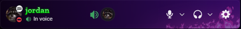
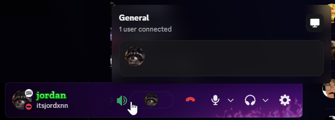

# Vencord Better Voice Panel

Better Voice Panel cleans up Discord's bottom-left voice area by replacing the large voice connection block with a small tile beside your account controls.

It keeps the useful parts close by: the current channel, connected user count, quick disconnect, avatar previews, and a hover popout for the people in voice. The rest of Discord's account row stays where you expect it: mute, deafen, settings, and your profile controls.

## Preview



The collapsed tile sits in the account panel without taking over the whole bottom bar.



Hovering the tile opens a small popout with the channel name, connected count, member avatars, and voice actions.

## Features

- Replaces Discord's large voice connection block with a compact account-panel tile.
- Shows the current voice channel or call name.
- Shows connected users as a small avatar strip.
- Opens a hover popout with display names, usernames, and voice-member controls.
- Opens a user's Discord profile when you click their avatar.
- Lets you right-click voice user avatars to adjust local volume.
- Marks users who are streaming with a small live badge.
- Jumps back to the active voice channel when you click the tile.
- Shows a disconnect button while hovering the tile.
- Keeps Discord's normal mute, deafen, and settings buttons in the account-control row.

## Requirements

- Discord desktop.
- A source build of Vencord.

This is a standalone userplugin. You do not need a companion plugin or a separate service.

## Install Vencord from source

Custom Vencord plugins only work with a source build. Install these first:

- [Git](https://git-scm.com/downloads)
- [Node.js](https://nodejs.org/)
- [pnpm](https://pnpm.io/installation)

Clone Vencord and install its dependencies:

```sh
git clone https://github.com/Vendicated/Vencord
cd Vencord
pnpm install --frozen-lockfile
```

## Install the plugin

From your Vencord folder:

```sh
mkdir -p src/userplugins
cd src/userplugins
git clone https://github.com/jordanw0204-rgb/vencord-better-voice-panel BetterVoicePanel
```

Build and inject Vencord:

```sh
cd ../..
pnpm build
pnpm inject
```

Restart Discord after injection.

## Enable the plugin

1. Open Discord settings.
2. Go to `Vencord` -> `Plugins`.
3. Enable `BetterVoicePanel`.
4. Join a voice channel or call.

The compact tile appears in the bottom-left account panel when you are connected to voice.

## Update

From your Vencord folder:

```sh
cd src/userplugins/BetterVoicePanel
git pull
cd ../../..
pnpm build
pnpm inject
```

Restart Discord after updating.

## Troubleshooting

### The plugin does not show up in Vencord

Make sure the folder name is exactly:

```text
src/userplugins/BetterVoicePanel
```

Then rebuild Vencord and restart Discord.

### The old voice panel is still visible

Rebuild, inject, and fully restart Discord:

```sh
pnpm build
pnpm inject
```

If Discord was already open, quit it completely before launching it again.

### The compact tile is missing while you are in voice

This usually means Discord changed the account-panel module that the plugin patches. Pull the latest version of the plugin, rebuild Vencord, inject again, and restart Discord.

### The account row looks cramped

Another account-panel plugin or a custom theme may be using the same space. Disable other account-panel tweaks temporarily to check for conflicts.

## Links

- [Vencord source install docs](https://docs.vencord.dev/installing/)
- [Vencord custom plugin docs](https://docs.vencord.dev/installing/custom-plugins/)
